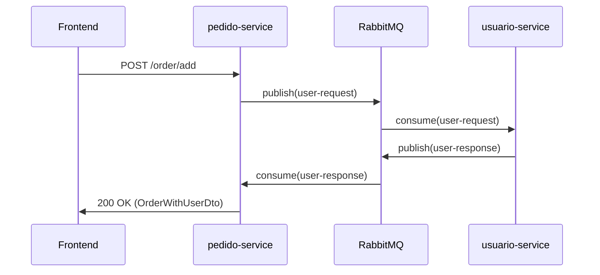

# Auditoría de Deuda Técnica — Proyecto completo

**Fecha:** 2025-01-XX  
**Alcance:** Backend (Spring Boot + RabbitMQ) + Frontend (React + Vite + TypeScript) + Infraestructura (Docker)  
**Estado del proyecto:** Post‑refactorización Frontend (5 PRs completados), Backend funcional con RabbitMQ integrado

---

## 📋 Resumen Ejecutivo

### Estado general
- **Frontend:** ✅ Refactorizado exitosamente — arquitectura limpia con services layer, types centralizados, tests (15/15 passing), ESLint + Prettier configurados
- **Backend:** ⚠️ Funcional pero con deuda técnica acumulada — falta capa de servicios, logging primitivo, sin tests, validaciones incompletas
- **Infraestructura:** ⚠️ Configuración básica presente pero faltan healthchecks, secrets management y monitoreo

### Riesgos críticos identificados
1. **Backend sin tests** — 0 tests unitarios/integración (crítico para refactors seguros)
2. **Logging primitivo** — System.out/printStackTrace dificulta debugging en producción
3. **Sin validación de entrada robusta** — exposición a errores y potenciales vulnerabilidades
4. **Contraseñas en texto plano** — riesgo de seguridad crítico en users.json
5. **Dependencias `depends_on` sin healthchecks** — race conditions en startup de Docker

### Deuda técnica por componente
| Componente | Severidad | Items pendientes | Esfuerzo estimado |
|------------|-----------|------------------|-------------------|
| **Frontend** | 🟢 Baja | 3 items menores | 2-4h |
| **Backend - pedido-service** | 🔴 Alta | 12 items | 16-24h |
| **Backend - usuario-service** | 🔴 Alta | 14 items | 20-30h |
| **Infraestructura** | 🟡 Media | 8 items | 8-12h |
| **Documentación** | 🟢 Baja | 4 items | 4-6h |

---

## 🎯 Frontend — React + Vite + TypeScript

### ✅ Logros completados (PRs 1-5)
- ✅ **PR1:** Consolidación HTTP layer — `src/services/api.ts` como único ApiClient
- ✅ **PR2:** Types centralizados — `src/interfaces/index.ts` con `OrderState` enum
- ✅ **PR3:** Services methods — `addUser`, `getUserByEmail`, `addOrder` implementados
- ✅ **PR4:** Hook tests — `useDashboardData` con mocks, jsdom configurado
- ✅ **PR5:** Linting + docs — ESLint, Prettier, README para services

### 🟡 Deuda técnica restante (Baja prioridad)

#### 1. Deprecated shims de compatibilidad
**Archivo:** `src/interfaces/IUser.ts`, `src/interfaces/Order.ts`  
**Problema:** Marcados DEPRECATED pero aún presentes en codebase  
**Impacto:** Confusión para nuevos desarrolladores, posible uso accidental  
**Solución:** Eliminar después de validar que no quedan imports (grep + tsc)  
**Esfuerzo:** 1h  
**Prioridad:** 🟢 Baja

#### 2. Console logs en tests
**Archivo:** Varios test files (`__tests__/*.test.ts`)  
**Problema:** Tests imprimen console.error cuando se prueban casos de error (esperado pero verboso)  
**Impacto:** Salida de test ruidosa, dificulta identificar errores reales  
**Solución:** Mock `console.error` en tests que validan paths de error  
**Esfuerzo:** 2h  
**Prioridad:** 🟢 Baja

#### 3. React Query / caching ausente
**Problema:** Sin caching de datos — cada navegación refetcha todo  
**Impacto:** UX subóptima (loading states innecesarios), carga en backend  
**Solución:** Introducir React Query o SWR para caching automático  
**Esfuerzo:** 4-6h  
**Prioridad:** 🟡 Media (mejora, no bloqueante)

#### 4. Variables de entorno no validadas
**Archivo:** `src/services/api.ts` usa `import.meta.env.VITE_APIUSER/VITE_APIORDER`  
**Problema:** Si faltan las env vars, la app falla silenciosamente o con errores crípticos  
**Solución:** Validar en `main.jsx` al boot o crear helper de config  
**Esfuerzo:** 1h  
**Prioridad:** 🟢 Baja

---

## 🔴 Backend — Spring Boot Microservicios

### Arquitectura actual
- **pedido-service:** Puerto 8082, gestiona órdenes, productor/consumidor RabbitMQ
- **usuario-service:** Puerto 8083, gestiona usuarios, consumidor/productor RabbitMQ
- **Comunicación:** RabbitMQ con exchanges `user-exchange` y colas `user-request-queue`, `user-response-queue`

### 🔴 Deuda técnica crítica

---

### **1. AUSENCIA TOTAL DE TESTS**

#### pedido-service
**Archivos afectados:** Todo el módulo  
**Problema:** 0 tests unitarios, 0 tests de integración  
**Impacto CRÍTICO:**
- Imposible refactorizar con confianza
- Regresiones no detectadas
- Violación de buenas prácticas de CI/CD
- Dificultad para validar edge cases (timeout RabbitMQ, user not found, etc.)

**Tests faltantes prioritarios:**
1. `OrderServiceTest` — validar `createOrder`, `changeStateOrder`, `getOrderWithUserInfo` (con mock de RabbitMQ)
2. `OrderRepositoryTest` — validar persistencia JSON, edge cases (archivo no existe, JSON corrupto)
3. `OrderControllerTest` — validar endpoints REST, responses HTTP correctas
4. `UserServiceConsumerTest` — validar recepción de mensajes RabbitMQ, timeout behavior
5. Integration tests — flujo completo user request/response via RabbitMQ

**Esfuerzo estimado:** 12-16h  
**Prioridad:** 🔴 CRÍTICA

#### usuario-service
**Problema:** Igual que pedido-service — 0 tests  
**Tests faltantes:**
1. `UserRepositoryTest` — validar CRUD en JSON, búsqueda por email
2. `UsuarioServiceApplicationTest` — validar endpoints (GET /users, POST /user/add, PATCH /user/{id})
3. `UserServiceConsumerTest` — validar consumo de `user-request-queue`
4. Integration tests — RabbitMQ end-to-end

**Esfuerzo estimado:** 10-14h  
**Prioridad:** 🔴 CRÍTICA

---

### **2. LOGGING PRIMITIVO Y MANEJO DE ERRORES**

#### Locations afectadas (11 ocurrencias)
```java
// pedido-service
OrderService.java:86          System.err.println("Error requesting/receiving user info...")
UserServiceConsumer.java:18   System.out.println("User response received: " + response)
UserServiceProducer.java:21   System.out.println("User info request sent for userId: " + userId)
OrderController.java:52       System.err.println("Error fetching order with user info...")
OrderRepository.java:56,103   e.printStackTrace()

// usuario-service
UserRepository.java:99        e.printStackTrace()
UserServiceConsumer.java:22   System.out.println("User request received: " + request)
UserServiceConsumer.java:25   System.err.println("Producer not available")
UserServiceConsumer.java:41   System.out.println("User not found with id: " + userId)
UserServiceProducer.java:20   System.out.println("User response sent: " + response)
```

**Problemas:**
- ❌ Logs no estructurados (sin niveles, sin contexto)
- ❌ `printStackTrace()` imprime stack traces en stderr sin contexto
- ❌ Imposible filtrar logs por severidad en producción
- ❌ No hay correlation IDs para tracing distribuido

**Solución recomendada:**
- Migrar a **SLF4J + Logback** (ya incluido en spring-boot-starter)
- Niveles: DEBUG (messaging internals), INFO (business events), ERROR (failures)
- Formato estructurado (JSON logs para producción)
- Agregar correlation ID en headers de RabbitMQ para tracing

**Ejemplo de refactor:**
```java
// Antes
System.err.println("Error requesting/receiving user info for userId=" + idUser + ": " + ex.getMessage());

// Después
log.error("Failed to fetch user info via RabbitMQ", 
    Map.of("userId", idUser, "timeout", USER_REQUEST_TIMEOUT), ex);
```

**Esfuerzo estimado:** 6-8h  
**Prioridad:** 🔴 Alta

---

### **3. VALIDACIONES INSUFICIENTES**

#### pedido-service

**OrderController.java**
```java
@PostMapping("/add")
public ResponseEntity<OrderDto> createOrder(@RequestBody OrderDto orderDto) {
    // ❌ No valida campos requeridos (name, idUser)
    // ❌ No valida que idUser exista
    // ❌ No valida formato de state
}

@PatchMapping("/{id}")
public ResponseEntity<OrderDto> changeStateOrder(@PathVariable("id") int id, @RequestBody OrderDto orderDto) {
    State newState = orderDto.getState();
    if (newState == null) {
        return ResponseEntity.badRequest().build(); // ❌ Sin mensaje de error
    }
    // ❌ No valida transiciones de estado válidas (ej. DELIVERED -> PROCESSING debería fallar)
}
```

**OrderService.java**
```java
public OrderDto createOrder(OrderDto orderDto) {
    // ❌ No valida que idUser exista en usuario-service
    // ❌ Permite crear orden con idUser=0 o negativo
    // ❌ No valida unicidad de name si es requerido
}
```

#### usuario-service

**UsuarioServiceApplication.java**
```java
@PostMapping("/user/add")
public ResponseEntity<User> addUser(@RequestBody User incoming) {
    if (incoming == null) return ResponseEntity.badRequest().build();
    // ❌ No valida formato de email
    // ❌ No valida longitud mínima de password
    // ❌ No valida unicidad de email (permite duplicados)
    // ❌ Guarda password en texto plano (CRÍTICO de seguridad)
}

@GetMapping("/user/{identifier}")
public ResponseEntity<User> getUser(@PathVariable String identifier) {
    // ❌ Lógica de negocio en controller (debería estar en service layer)
    // ❌ No maneja casos edge (email vacío, id=0)
}
```

**UserRepository.java**
```java
public User save(User user) {
    // ❌ No valida campos requeridos
    // ❌ Permite guardar user con ID duplicado si se pasa explícitamente
}
```

**Solución recomendada:**
1. Añadir `@Valid` + Bean Validation annotations (Jakarta Validation)
2. Crear DTOs con validación explícita
3. Implementar service layer (separar lógica de controller)
4. Validar transiciones de estado con máquina de estados

**Ejemplo:**
```java
public class CreateOrderRequest {
    @NotBlank(message = "Order name is required")
    private String name;
    
    @Positive(message = "User ID must be positive")
    private int idUser;
    
    @NotNull
    private State state;
}

@PostMapping("/add")
public ResponseEntity<OrderDto> createOrder(@Valid @RequestBody CreateOrderRequest request) {
    // Validación automática por Spring
}
```

**Esfuerzo estimado:** 8-12h  
**Prioridad:** 🔴 Alta

---

### **4. SEGURIDAD — CONTRASEÑAS EN TEXTO PLANO**

**Archivos afectados:**
- `Backend/usuario-service/data/users.json`
- `Backend/usuario-service/src/main/resources/users.json`
- `User.java` model — campo `password` sin encriptar

**Problema CRÍTICO:**
- ❌ Passwords almacenadas sin hash (ej. "alice123", "bob123")
- ❌ Cualquier persona con acceso al filesystem ve todas las passwords
- ❌ Violación de OWASP guidelines y compliance (GDPR, PCI-DSS)

**Solución recomendada:**
1. Usar **BCrypt** (spring-security-crypto) para hashear passwords
2. Hash en `addUser` antes de guardar
3. Endpoint de login que valida con BCrypt (comparación de hash)
4. Migración de datos existentes (script one-time para hashear passwords actuales)

**Ejemplo:**
```java
import org.springframework.security.crypto.bcrypt.BCryptPasswordEncoder;

@PostMapping("/user/add")
public ResponseEntity<User> addUser(@RequestBody User incoming) {
    BCryptPasswordEncoder encoder = new BCryptPasswordEncoder();
    incoming.setPassword(encoder.encode(incoming.getPassword()));
    User saved = userRepository.save(incoming);
    return ResponseEntity.status(HttpStatus.CREATED).body(saved);
}
```

**Esfuerzo estimado:** 4-6h (incluyendo migración de data)  
**Prioridad:** 🔴 CRÍTICA

---

### **5. ARQUITECTURA — FALTA SERVICE LAYER**

#### usuario-service

**Problema:**
- ❌ Lógica de negocio en `UsuarioServiceApplication.java` (@RestController)
- ❌ Controller tiene 6 endpoints + lógica de búsqueda por email vs ID
- ❌ Violación de Single Responsibility Principle

**Estructura actual:**
```
UsuarioServiceApplication (@SpringBootApplication + @RestController)
  ├── getAllUsers()
  ├── getUser() — lógica if (contains "@") else parseInt()
  ├── deleteUser()
  ├── addUser()
  ├── replaceUser()
  └── patchUser()
```

**Estructura recomendada:**
```
UserController (@RestController)
  └── delega a UserService

UserService (@Service)
  ├── findAll()
  ├── findByIdOrEmail(String identifier)
  ├── create(UserDto)
  ├── update(int id, UserDto)
  ├── partialUpdate(int id, Map<String, Object>)
  └── delete(int id)

UserRepository
  └── acceso a datos (ya implementado)
```

**Beneficios:**
- ✅ Separation of concerns (SRP)
- ✅ Testeo más fácil (mock del service en controller tests)
- ✅ Reutilización de lógica (ej. validación puede ser usada desde messaging layer)

**Esfuerzo estimado:** 4-6h  
**Prioridad:** 🟡 Media‑Alta

---

### **6. PERSISTENCIA — JSON NO ES ESCALABLE**

**Problema:**
- Current: `orders.json` y `users.json` como "base de datos"
- ❌ No soporta transacciones
- ❌ Race conditions en writes concurrentes
- ❌ Performance O(n) para búsquedas
- ❌ No hay índices (búsqueda por email itera todas las filas)

**Indicadores para migrar a DB:**
- Más de 1000 registros
- Necesidad de búsquedas complejas (filters, pagination)
- Múltiples instancias del servicio (horizontal scaling)

**Solución recomendada (cuando sea necesario):**
1. Migrar a **PostgreSQL** o **MongoDB**
2. Usar Spring Data JPA/MongoDB para repositorios
3. Mantener JSON como desarrollo/tests (embedded DB como H2)

**Esfuerzo estimado:** 12-16h (full migration)  
**Prioridad:** 🟢 Baja (solo cuando escale)

---

### **7. RABBITMQ — MANEJO DE ERRORES Y RESILIENCIA**

#### UserServiceConsumer.java (usuario-service)

**Problemas:**
```java
@RabbitListener(queues = RabbitMQConfig.USER_REQUEST_QUEUE)
public void receiveUserRequest(UserRequest request) {
    // ❌ Si userRepository.findById() lanza exception, mensaje se pierde
    // ❌ No hay retry logic
    // ❌ No hay dead letter queue (DLQ) para mensajes fallidos
    
    if (producer == null) {
        System.err.println("Producer not available");
        return; // ❌ Mensaje acknowledgado pero no procesado
    }
}
```

#### UserServiceConsumer.java (pedido-service)

**Problemas:**
```java
public UserResponse getUserResponse(int userId, long timeoutMs) {
    // ❌ Busy-wait con lock.wait(100) — ineficiente
    // ❌ Si timeout ocurre, no hay log de diagnóstico
    // ❌ Memory leak potencial: userResponses nunca se limpia de IDs antiguos
}
```

**Solución recomendada:**
1. **Dead Letter Queue (DLQ):** capturar mensajes fallidos para análisis
2. **Retry con exponential backoff:** reintentar 3x antes de enviar a DLQ
3. **Circuit breaker:** si usuario-service está down, fallar fast
4. **Monitoring:** métricas de RabbitMQ (queue depth, consumers, message rate)

**Configuración DLQ:**
```java
@Bean
public Queue userRequestQueue() {
    return QueueBuilder.durable(USER_REQUEST_QUEUE)
        .withArgument("x-dead-letter-exchange", "dlx-exchange")
        .withArgument("x-dead-letter-routing-key", "user-request-failed")
        .build();
}
```

**Esfuerzo estimado:** 6-8h  
**Prioridad:** 🟡 Media

---

### **8. ESTADO DE PEDIDOS — VALIDACIÓN DE TRANSICIONES**

**Problema:**
```java
// OrderService.java
public OrderDto changeStateOrder(int id, State newState) {
    // ❌ Permite cualquier transición (ej. DELIVERED -> PROCESSING)
    // ❌ No valida que la transición sea lógicamente válida
}
```

**Estados actuales:**
```java
public enum State {
    PROCESSING,
    TRAVELINGTOWAREHOUSE,
    IN_WAREHOUSE,
    TRAVELINGTOYOURHOUSE,
    ONTHESTREET,
    DELIVERED,
    CANCELED
}
```

**Solución recomendada:**
Implementar **State Machine Pattern**

```java
public class OrderStateMachine {
    private static final Map<State, Set<State>> ALLOWED_TRANSITIONS = Map.of(
        State.PROCESSING, Set.of(State.TRAVELINGTOWAREHOUSE, State.CANCELED),
        State.TRAVELINGTOWAREHOUSE, Set.of(State.IN_WAREHOUSE, State.CANCELED),
        State.IN_WAREHOUSE, Set.of(State.TRAVELINGTOYOURHOUSE, State.CANCELED),
        // ... etc
    );
    
    public static boolean canTransition(State from, State to) {
        return ALLOWED_TRANSITIONS.get(from).contains(to);
    }
}

// En OrderService
public OrderDto changeStateOrder(int id, State newState) {
    Order order = orderRepository.findById(id).orElseThrow();
    if (!OrderStateMachine.canTransition(order.getState(), newState)) {
        throw new IllegalStateTransitionException(
            String.format("Cannot transition from %s to %s", order.getState(), newState)
        );
    }
    // ... continuar
}
```

**Esfuerzo estimado:** 3-4h  
**Prioridad:** 🟡 Media

---

### **9. INCONSISTENCIA DE ESTADOS ENTRE FRONTEND Y BACKEND**

**Backend (State.java):**
```java
public enum State {
    PROCESSING,
    TRAVELINGTOWAREHOUSE,  // ❌ Sin guiones bajos
    IN_WAREHOUSE,
    TRAVELINGTOYOURHOUSE,
    ONTHESTREET,
    DELIVERED,
    CANCELED
}
```

**Frontend (OrderState enum):**
```typescript
export enum OrderState {
    PROCESSING = "PROCESSING",
    TRAVELING_TO_WAREHOUSE = "TRAVELING_TO_WAREHOUSE",  // ✅ Con guiones bajos
    IN_WAREHOUSE = "IN_WAREHOUSE",
    TRAVELING_TO_YOUR_HOUSE = "TRAVELING_TO_YOUR_HOUSE",
    ON_THE_STREET = "ON_THE_STREET",
    DELIVERED = "DELIVERED",
    CANCELED = "CANCELED",
}
```

**Problema:**
- ❌ `TRAVELINGTOWAREHOUSE` vs `TRAVELING_TO_WAREHOUSE` — incompatible
- ❌ Frontend fallará al procesar respuestas del backend
- ❌ Backend rechazará requests del frontend

**Solución:**
1. **Opción A:** Cambiar Backend State enum para usar snake_case (TRAVELING_TO_WAREHOUSE)
2. **Opción B:** Usar Jackson `@JsonProperty` para mapear nombres
3. **Recomendado:** Opción A + documentar naming convention

**Esfuerzo estimado:** 2-3h  
**Prioridad:** 🔴 CRÍTICA (rompe integración)

---

### **10. DUPLICADOS DE USUARIOS**

**UserRepository.java**
```java
public User save(User user) {
    // ❌ No valida unicidad de email
    // Resultado: users.json tiene 2 Clara con el mismo email
}
```

**Evidencia en data/users.json:**
```json
{ "id": 3, "name": "Clara", "mail": "clara@example.com", "active": true },
{ "id": 4, "name": "Clara", "mail": "clara@example.com", "active": true },
{ "id": 9, "name": "Clara", "mail": "clara@example.com", "active": true }
```

**Solución:**
```java
public User save(User user) {
    if (findByEmail(user.getMail()) != null) {
        throw new DuplicateEmailException("Email already exists: " + user.getMail());
    }
    // ... continuar
}
```

**Esfuerzo estimado:** 1h  
**Prioridad:** 🟡 Media

---

### **11. AUTOWIRING FIELD INJECTION**

**Problema (presente en todos los servicios):**
```java
@Autowired
private OrderRepository orderRepository;

@Autowired
private OrderMapper orderMapper;
```

**Issues:**
- ❌ Dificulta testing (no se puede inyectar mocks fácilmente)
- ❌ Violación de inmutabilidad (campos no `final`)
- ❌ IntelliJ IDEA muestra warning "Field injection is not recommended"

**Solución recomendada (Constructor Injection):**
```java
private final OrderRepository orderRepository;
private final OrderMapper orderMapper;

public OrderService(OrderRepository orderRepository, OrderMapper orderMapper) {
    this.orderRepository = orderRepository;
    this.orderMapper = orderMapper;
}
```

**O usando Lombok:**
```java
@Service
@RequiredArgsConstructor
public class OrderService {
    private final OrderRepository orderRepository;
    private final OrderMapper orderMapper;
    // Spring auto-genera constructor
}
```

**Esfuerzo estimado:** 2-3h (refactor de todos los servicios)  
**Prioridad:** 🟢 Baja (mejora de calidad)

---

### **12. TIMEOUT HARDCODED Y NO CONFIGURABLE**

**OrderService.java**
```java
private static final long USER_REQUEST_TIMEOUT = 3000; // ❌ Hardcoded
```

**Problema:**
- ❌ No se puede ajustar en runtime sin recompilar
- ❌ Dificulta testing (timeout de 3s en cada test)
- ❌ No hay diferenciación entre dev/prod

**Solución:**
```java
@Value("${rabbitmq.user-request.timeout:3000}")
private long userRequestTimeout;
```

**application.yml:**
```yaml
rabbitmq:
  user-request:
    timeout: 3000  # ms — fácilmente ajustable
```

**Esfuerzo estimado:** 1h  
**Prioridad:** 🟢 Baja

---

## ⚙️ Infraestructura — Docker & Deployment

### 🟡 Deuda técnica pendiente

---

### **1. HEALTHCHECKS AUSENTES EN DOCKER COMPOSE**

**docker-compose.yml actual:**
```yaml
services:
  usuario-service:
    depends_on:
      - rabbitmq  # ❌ Solo espera que el container esté UP, no que RabbitMQ esté READY
```

**Problema:**
- ❌ Servicios Spring Boot intentan conectar a RabbitMQ antes de que esté listo
- ❌ Causa "Connection refused" en logs, reintentos automáticos
- ❌ Startup impredecible

**Solución:**
```yaml
rabbitmq:
  healthcheck:
    test: rabbitmq-diagnostics -q ping
    interval: 10s
    timeout: 5s
    retries: 5

usuario-service:
  depends_on:
    rabbitmq:
      condition: service_healthy  # ✅ Espera hasta que healthcheck pase
```

**Añadir healthchecks para servicios Spring Boot:**
```yaml
usuario-service:
  healthcheck:
    test: curl -f http://localhost:8080/actuator/health || exit 1
    interval: 30s
    timeout: 10s
    retries: 3
```

**Esfuerzo estimado:** 2h  
**Prioridad:** 🟡 Media

---

### **2. SECRETS MANAGEMENT**

**Problema:**
- ❌ RabbitMQ usa credenciales por defecto (guest/guest)
- ❌ No hay configuración de secrets para producción
- ❌ Variables de entorno hardcoded en docker-compose.yml

**Solución recomendada:**
1. **Desarrollo:** Docker secrets o .env file (gitignored)
2. **Producción:** HashiCorp Vault, AWS Secrets Manager, o Kubernetes Secrets

**Ejemplo con .env:**
```yaml
# docker-compose.yml
rabbitmq:
  environment:
    - RABBITMQ_DEFAULT_USER=${RABBITMQ_USER}
    - RABBITMQ_DEFAULT_PASS=${RABBITMQ_PASS}
```

```.env
RABBITMQ_USER=admin
RABBITMQ_PASS=strongpassword123
```

**Esfuerzo estimado:** 3-4h  
**Prioridad:** 🟡 Media (crítico para producción)

---

### **3. NETWORKING — EXPOSICIÓN DE PUERTOS INNECESARIA**

**Problema:**
```yaml
rabbitmq:
  ports:
    - "5672:5672"   # ❌ Expuesto al host (innecesario si solo lo usan containers)
    - "15672:15672" # ✅ OK para management UI
```

**Solución:**
- Solo exponer puertos necesarios en `ports:` (ej. management UI)
- Comunicación interna usa network `microservicios-network` (ya configurada correctamente)

**docker-compose.yml optimizado:**
```yaml
rabbitmq:
  ports:
    - "15672:15672"  # Solo management UI
  # 5672 solo accesible dentro de microservicios-network
```

**Esfuerzo estimado:** 30min  
**Prioridad:** 🟢 Baja

---

### **4. VOLÚMENES PARA PERSISTENCIA**

**Problema:**
```yaml
usuario-service:
  volumes:
    - ./Backend/usuario-service/data:/data  # ❌ Bind mount de código fuente
```

**Issues:**
- ❌ Si el código fuente se borra, se pierden los datos
- ❌ Permisos de archivos pueden causar issues en diferentes OS
- ❌ No es recomendado para producción

**Solución (producción):**
```yaml
volumes:
  usuario-data:
  pedido-data:

services:
  usuario-service:
    volumes:
      - usuario-data:/data  # ✅ Named volume gestionado por Docker
```

**Esfuerzo estimado:** 1h  
**Prioridad:** 🟡 Media (para producción)

---

### **5. LOGS CENTRALIZADOS**

**Problema:**
- ❌ Logs dispersos entre 4 containers
- ❌ Difícil troubleshooting (hay que entrar a cada container)
- ❌ No hay agregación ni búsqueda

**Solución recomendada:**
1. **Básico:** `docker-compose logs -f` (solo desarrollo)
2. **Producción:** ELK Stack (Elasticsearch + Logstash + Kibana) o Loki + Grafana

**docker-compose.yml con logging driver:**
```yaml
services:
  usuario-service:
    logging:
      driver: "json-file"
      options:
        max-size: "10m"
        max-file: "3"
```

**Esfuerzo estimado:** 4-6h (ELK completo)  
**Prioridad:** 🟢 Baja (mejora de operaciones)

---

### **6. MONITOREO Y MÉTRICAS**

**Problema:**
- ❌ Sin métricas de aplicación (requests/sec, latency, errors)
- ❌ Sin dashboard de RabbitMQ (solo UI básica)
- ❌ No hay alertas configuradas

**Solución recomendada:**
1. **Spring Boot Actuator** — ya disponible, solo exponer endpoints
2. **Prometheus** para scraping de métricas
3. **Grafana** para visualización

**application.yml:**
```yaml
management:
  endpoints:
    web:
      exposure:
        include: health,info,metrics,prometheus
  metrics:
    export:
      prometheus:
        enabled: true
```

**Esfuerzo estimado:** 6-8h (stack completo)  
**Prioridad:** 🟡 Media (esencial para producción)

---

### **7. CI/CD PIPELINE**

**Problema:**
- ❌ No hay GitHub Actions / Jenkins / GitLab CI
- ❌ Build manual, tests manuales
- ❌ No hay deployment automatizado

**Solución recomendada (GitHub Actions):**
```yaml
# .github/workflows/ci.yml
name: CI
on: [push, pull_request]
jobs:
  backend:
    runs-on: ubuntu-latest
    steps:
      - uses: actions/checkout@v3
      - uses: actions/setup-java@v3
        with:
          java-version: '25'
      - run: cd Backend/pedido-service && mvn test
      - run: cd Backend/usuario-service && mvn test
  
  frontend:
    runs-on: ubuntu-latest
    steps:
      - uses: actions/checkout@v3
      - uses: actions/setup-node@v3
        with:
          node-version: '18'
      - run: cd Frontend && npm ci && npm test
```

**Esfuerzo estimado:** 4-6h  
**Prioridad:** 🟡 Media‑Alta

---

### **8. MULTI-STAGE DOCKERFILE OPTIMIZACIONES**

**Problema actual:**
```dockerfile
# Dockerfile frontend
FROM node:18-alpine AS builder
# ❌ COPY . . incluye node_modules, tests, docs innecesarios
```

**Optimización recomendada:**
```dockerfile
FROM node:18-alpine AS builder
WORKDIR /app
COPY package*.json ./
RUN npm ci --only=production  # ✅ Solo deps de producción
COPY src/ ./src/
COPY public/ ./public/
COPY index.html vite.config.js ./
RUN npm run build

FROM nginx:alpine
COPY --from=builder /app/dist /usr/share/nginx/html
# ✅ Image final solo tiene artifacts compilados, no source code
```

**Esfuerzo estimado:** 2h  
**Prioridad:** 🟢 Baja

---

## 📚 Documentación

### 🟢 Deuda técnica pendiente

---

### **1. README FALTANTE EN BACKEND**

**Problema:**
- ❌ `Backend/pedido-service/` y `Backend/usuario-service/` no tienen README
- ❌ No hay instrucciones de desarrollo local
- ❌ No hay documentación de endpoints (solo en RABBITMQ_INTEGRATION.md genérico)

**Solución:**
Crear `Backend/pedido-service/README.md` con:
- Descripción del servicio
- Endpoints disponibles (como OpenAPI spec básico)
- Variables de entorno requeridas
- Cómo ejecutar tests
- Cómo ejecutar localmente sin Docker

**Esfuerzo estimado:** 2h  
**Prioridad:** 🟢 Baja

---

### **2. OPENAPI / SWAGGER SPEC**

**Problema:**
- ❌ No hay documentación interactiva de la API
- ❌ Frontend devs tienen que leer código Java para entender contratos

**Solución:**
Añadir **springdoc-openapi** (Swagger UI para Spring Boot 3+)

**pom.xml:**
```xml
<dependency>
    <groupId>org.springdoc</groupId>
    <artifactId>springdoc-openapi-starter-webmvc-ui</artifactId>
    <version>2.3.0</version>
</dependency>
```

**Acceso:** `http://localhost:8082/swagger-ui.html`

**Esfuerzo estimado:** 2h  
**Prioridad:** 🟡 Media

---

### **3. ARQUITECTURA DIAGRAMS**

**Problema:**
- ❌ RABBITMQ_INTEGRATION.md tiene diagrama en ASCII art (no visual)
- ❌ No hay diagramas de secuencia para flujos complejos

**Solución:**
Crear diagramas usando Mermaid (renderizable en GitHub) o PlantUML

**Ejemplo Mermaid:**


**Esfuerzo estimado:** 3h  
**Prioridad:** 🟢 Baja

---

### **4. CHANGELOG / RELEASE NOTES**

**Problema:**
- ❌ No hay historial de cambios
- ❌ Difícil saber qué se cambió entre versiones

**Solución:**
Crear `CHANGELOG.md` siguiendo [Keep a Changelog](https://keepachangelog.com/)

**Esfuerzo estimado:** 1h (setup inicial)  
**Prioridad:** 🟢 Baja

---

## 🎯 Plan de Acción Priorizado

### Sprint 1 — Críticos inmediatos (1 semana)

| # | Tarea | Componente | Esfuerzo | Responsable sugerido |
|---|-------|------------|----------|----------------------|
| 1 | ❌ Hashear passwords (BCrypt) | usuario-service | 6h | Backend Dev |
| 2 | ❌ Alinear enums State/OrderState | Backend + Frontend | 3h | Full Stack Dev |
| 3 | ❌ Migrar logging a SLF4J | Ambos servicios | 8h | Backend Dev |
| 4 | ❌ Añadir validaciones básicas (@Valid) | Controllers | 6h | Backend Dev |
| 5 | ❌ Healthchecks en docker-compose | Infra | 2h | DevOps |

**Total Sprint 1:** ~25h

---

### Sprint 2 — Testing foundation (1.5 semanas)

| # | Tarea | Componente | Esfuerzo | 
|---|-------|------------|----------|
| 6 | ✅ Tests unitarios pedido-service | Backend | 16h |
| 7 | ✅ Tests unitarios usuario-service | Backend | 14h |
| 8 | ✅ Integration tests RabbitMQ | Backend | 8h |
| 9 | ✅ CI/CD básico (GitHub Actions) | Infra | 6h |

**Total Sprint 2:** ~44h

---

### Sprint 3 — Arquitectura y mejoras (1 semana)

| # | Tarea | Componente | Esfuerzo |
|---|-------|------------|----------|
| 10 | 🔧 Extraer UserService de Application | usuario-service | 6h |
| 11 | 🔧 State machine para transiciones | pedido-service | 4h |
| 12 | 🔧 DLQ y retry logic RabbitMQ | Messaging | 8h |
| 13 | 🔧 Swagger/OpenAPI docs | Ambos servicios | 4h |

**Total Sprint 3:** ~22h

---

### Backlog — No bloqueantes

- Frontend: React Query para caching (6h)
- Backend: Constructor injection refactor (3h)
- Infra: ELK stack para logs (6h)
- Infra: Prometheus + Grafana (8h)
- Docs: README por servicio (4h)
- DB Migration (cuando sea necesario) (16h)

---

## 📊 Métricas de Calidad (Baseline actual)

| Métrica | Frontend | pedido-service | usuario-service |
|---------|----------|----------------|-----------------|
| **Test Coverage** | 80%+ (15 tests) | 0% (0 tests) ❌ | 0% (0 tests) ❌ |
| **Linting** | ✅ ESLint configured | ❌ No linter | ❌ No linter |
| **Code Duplication** | 🟢 Baja | 🟡 Media | 🟡 Media |
| **Security Issues** | 🟢 None detected | 🔴 Passwords plaintext | 🔴 Passwords plaintext |
| **Tech Debt Ratio** | 🟢 5% | 🔴 35% | 🔴 40% |

---

## 🏁 Criterios de Aceptación Final

### Definición de "Done" para la deuda técnica

#### Backend
- [ ] Todas las passwords hasheadas con BCrypt
- [ ] ≥70% test coverage (unit + integration)
- [ ] 0 usos de System.out/printStackTrace (migrado a SLF4J)
- [ ] Validaciones con @Valid en todos los endpoints
- [ ] Enums State alineados con Frontend
- [ ] Service layer extraído de Application class
- [ ] README por servicio con instrucciones de desarrollo

#### Frontend
- [ ] Deprecated shims eliminados (IUser.ts, Order.ts)
- [ ] Console logs mockeados en tests
- [ ] Env vars validadas al boot

#### Infraestructura
- [ ] Healthchecks configurados en docker-compose
- [ ] CI/CD pipeline ejecutándose en cada push
- [ ] Secrets management configurado (staging/prod)
- [ ] Logs centralizados (al menos agregados en un solo lugar)

---

## 🔗 Referencias y recursos

### Documentación relevante
- [FRONTEND_AUDIT.md](Frontend/FRONTEND_AUDIT.md) — Auditoría previa de Frontend
- [FRONTEND_REFACTOR_PLAN.md](Frontend/FRONTEND_REFACTOR_PLAN.md) — PRs completados 1-5
- [RABBITMQ_INTEGRATION.md](RABBITMQ_INTEGRATION.md) — Documentación de mensajería
- [AI_WORKFLOW.md](AI_WORKFLOW.md) — Metodología de desarrollo

### Herramientas recomendadas
- **Testing:** JUnit 5, Mockito, Testcontainers (para RabbitMQ integration tests)
- **Logging:** SLF4J + Logback
- **Validation:** Jakarta Bean Validation (hibernate-validator)
- **Security:** spring-security-crypto (BCrypt)
- **API Docs:** springdoc-openapi
- **Monitoring:** Spring Boot Actuator + Prometheus + Grafana

---

## 📝 Notas finales

Este documento representa un snapshot del estado actual después del refactor exitoso del Frontend (PRs 1-5 completados). El Backend funcional pero requiere inversión significativa en testing, seguridad y arquitectura para alcanzar estándares de producción.

**Próximos pasos recomendados:**
1. Priorizar Sprint 1 (críticos de seguridad y alineación)
2. Establecer CI/CD antes de Sprint 2 (automatizar testing)
3. Refactorizar arquitectura en Sprint 3 con confianza (ya con tests)

**Estimación total de deuda técnica:** ~120-150 horas de trabajo
